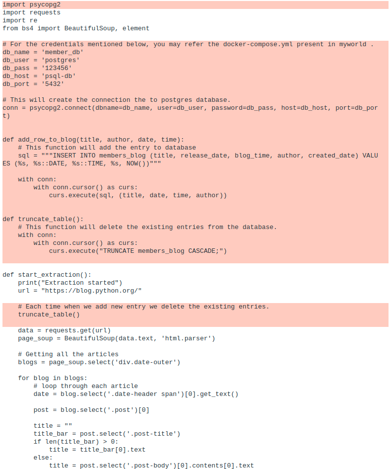
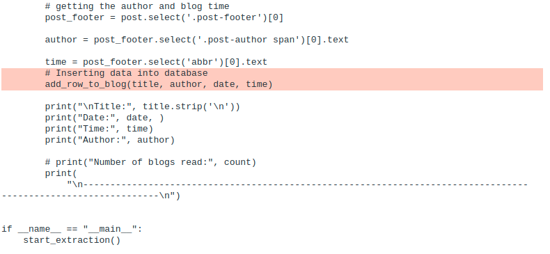

# Save the scapped data to Postgres Database

- Now let us save the data that we have extracted now into a postgres database.
- Let us use the same database member_db that we have created in the previous workshop to save the database.
- If you have not created the mentioned database, follow the below step to create the database.

1. Open a new tab in you terminal and exec into the psql-db container. Since you have run the `docker-compose up` command 
before, both workshop_web_container and psql-db containers should be up. So we need not bring the container up. We can directly 
   run the below command to exec into the container
   
        docker exec -it psql-db sh

    - Please note that psql-db and workshop_web_container are the container_name that you have mentioned in the 
docker-compose.yml file. If the names you have specified is different, use that.
    
2. Now run the below commands to login to psql.

       psql -U postgres
3. Now create the database by running below command.

       CREATE DATABASE member_db;

- Since the database is ready, let use create the required tables and columns to that database using the Django models. Keep the database container
  running in this tab and you may continue the development in a new tab.
- Follow the below steps:

1. Open the models.py file which is present in the members folder. 

      
     File path : myworld/members/models.py

     vi models.py
        or
     gedit models.py

2. Currently we have one model Students present in that file. Let use add one more model called Blog into the same file.
For that append the below code to that file
   

    class Blog(models.Model):
       title = models.CharField(max_length=500)
       release_date = models.DateTimeField('Realse Date')
       blog_time = models.CharField(max_length=50)
       author = models.CharField(max_length=200)
       created_date = models.DateTimeField('Created Date', auto_now_add=True, null=True)
   
       def __str__(self):                               
           return self.title

  - Now models.py will look like this

         from django.db import models
   
         BRANCH_CHOICES = (
             ("BA", "BA"),
             ("B.COM", "B.COM"),
             ("MBA", "MBA"),
             ("CA", "CA"),
         )
         
         # Create your models here.
         class Students(models.Model):
             first_name = models.CharField(max_length=200)
             last_name = models.CharField(max_length=200)
             address = models.CharField(max_length=200)
             roll_number = models.IntegerField()
             mobile = models.CharField(max_length=10)
             branch = models.CharField(max_length=10, choices=BRANCH_CHOICES, null=True)
         
             def __str__(self):
                 return self.first_name + " " + self.last_name
         
         class Blog(models.Model):
             title = models.CharField(max_length=500)
             release_date = models.DateTimeField('Realse Date')
             blog_time = models.CharField(max_length=50)
             author = models.CharField(max_length=200)
             created_date = models.DateTimeField('Created Date', auto_now_add=True, null=True)
         
             def __str__(self):                               
                 return self.title
   
   - Each class represents a model which will in turn represent a table in the database and each property of that class refers to
each columns in that table.
     
3. Let us run makemigrations to create the database table using the models. For that first open the tab where workshop_web_container is running.
If it is not running anywhere, open a new tab and run the below command to run the container
   
       docker exec -it workshop_web_container sh
  - Keep the container running in the tab. Anymore if you have to modify any other files you can open a new tab. Right now 
you should have to 2 tabs where in one workshop_web_container should be running and in other psql-db container should be running.
    
4. Once you get inside workshop_web_container, run the below commands

        python manage.py makemigrations
        python manage.py migrate
5. Now go to the psql-db (database container) and run below commands to ensure that the new table members_blog is created.

        postgres=# \c member_db
        You are now connected to database "member_db" as user "postgres".
   
        member_db=# \dt
  - The above command should list down all the tables in the member_db and there should be members_blog present.
    
        \d members_blog
  - This command should describe the member_blog table and show all the columns present.

- Now let us modify our script so that it will start saving the extracted data into the created table.
- Open the web_scrapper.py file present in the myworld folder and replace the script with the one given below.

        import psycopg2
        import requests
        import re
        from bs4 import BeautifulSoup, element
        
        # For the credentials mentioned below, you may refer the docker-compose.yml present in myworld .
        db_name = 'member_db'
        db_user = 'postgres'
        db_pass = '123456'
        db_host = 'psql-db'
        db_port = '5432'
        
        # This will create the connection the to postgres database.
        conn = psycopg2.connect(dbname=db_name, user=db_user, password=db_pass, host=db_host, port=db_port)
        
        
        def add_row_to_blog(title, author, date, time):
            # This function will add the entry to database
            sql = """INSERT INTO members_blog (title, release_date, blog_time, author, created_date) VALUES (%s, %s::DATE, %s::TIME, %s, NOW())"""
        
            with conn:
                with conn.cursor() as curs:
                    curs.execute(sql, (title, date, time, author))
        
        
        def truncate_table():
            # This function will delete the existing entries from the database.
            with conn:
                with conn.cursor() as curs:
                    curs.execute("TRUNCATE members_blog CASCADE;")
        
        
        def start_extraction():
            print("Extraction started")
            url = "https://blog.python.org/"
        
            # Each time when we add new entry we delete the existing entries.
            truncate_table()
        
            data = requests.get(url)
            page_soup = BeautifulSoup(data.text, 'html.parser')
        
            # Getting all the articles
            blogs = page_soup.select('div.date-outer')
        
            for blog in blogs:
                # loop through each article
                date = blog.select('.date-header span')[0].get_text()
        
                post = blog.select('.post')[0]
        
                title = ""
                title_bar = post.select('.post-title')
                if len(title_bar) > 0:
                    title = title_bar[0].text
                else:
                    title = post.select('.post-body')[0].contents[0].text
        
                # getting the author and blog time
                post_footer = post.select('.post-footer')[0]
        
                author = post_footer.select('.post-author span')[0].text
        
                time = post_footer.select('abbr')[0].text
                # Inserting data into database
                add_row_to_blog(title, author, date, time)
        
                print("\nTitle:", title.strip('\n'))
                print("Date:", date, )
                print("Time:", time)
                print("Author:", author)
        
                # print("Number of blogs read:", count)
                print(
                    "\n---------------------------------------------------------------------------------------------------------------\n")
        
        
        if __name__ == "__main__":
            start_extraction()

  - The difference in the previouse script and the current one can be visible in the given image
    
    